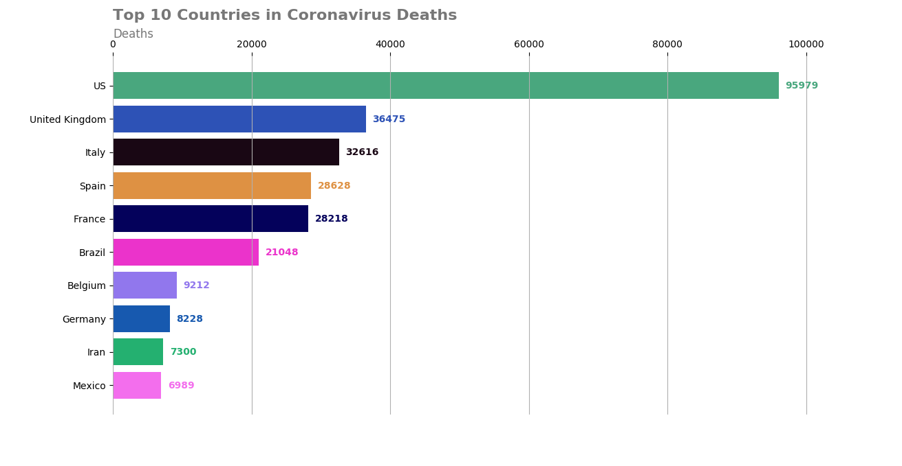
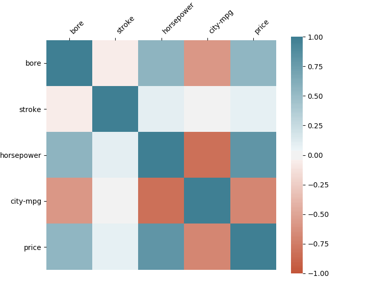
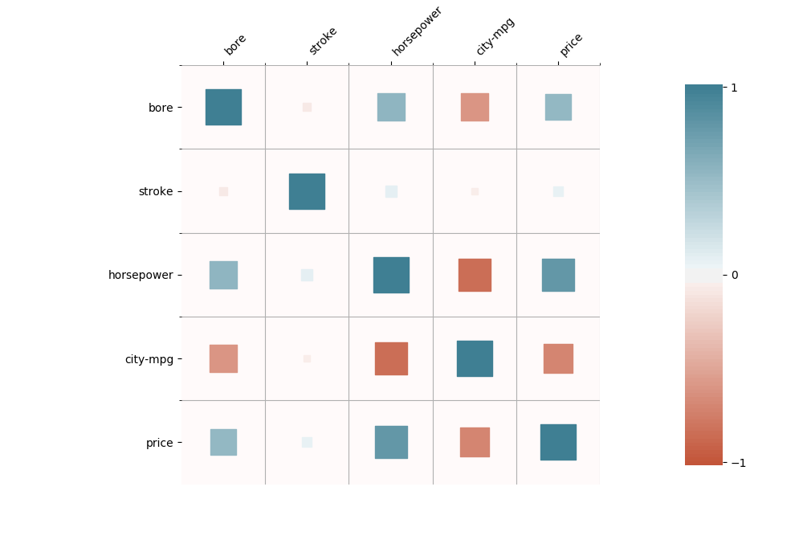
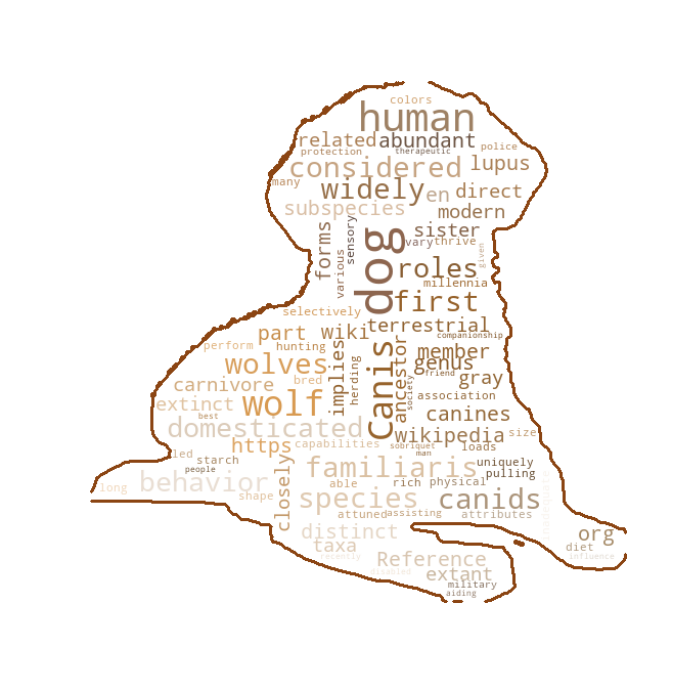
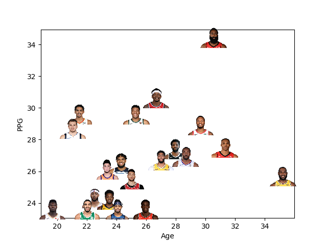
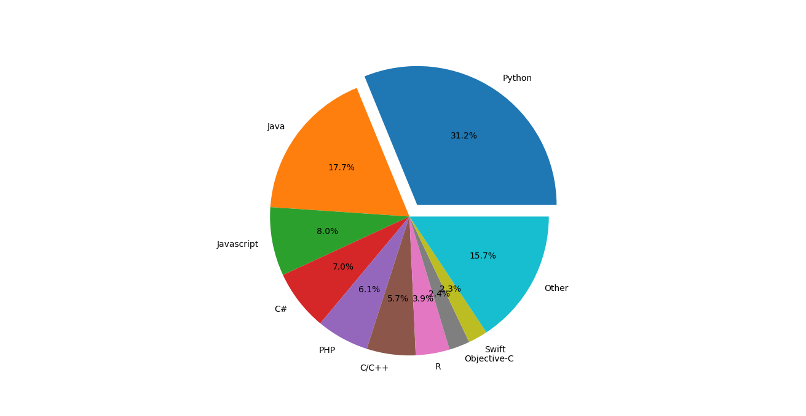

# Different Types of Data Visualizations in Python

In this repository, I have compiled a python implementation of different types of data visualizations which will be very useful in the field of data science.

Here are the list of some visualization techniques:

- *Barchart visualization*
- *Heatmap visualization*
- *Wordcloud visualization*
- *Scatter Plot visualization*
- *Pie Chart visualization*

**Required Packages:**

`numpy, matplotlib, seaborn, PIL, wordcloud`

All of these packages can be installed via *pip* package manager.

# Barchart Visualization

Bar chart can be very useful if you want to demonstrate a categorical data with its values. You can visualize this categorical data with both vertical or horizontal rectangular bars. 

Here, I visualized ***Top 10 Countries in Coronavirus Deaths*** as of May 23 in a bar chart graph. I have get the real-time Covid-19 stats using this [link](https://pomber.github.io/covid19/timeseries.json) [1]. 

# Heatmap Visualization

Heatmap visualizations can be very useful to observe the correlation matrix among the data variables. 

In traditional heatmap visualizations, this correlation is represented in terms of colors which can be shown in the next figure. Grids with high color range emphasize more correlation between data variables.   

In the following heatmap visualization on the other hand, grid rectangle sizes also change depending on the correlation among the data variables. Higher rectangle sizes and color values represent more correlation between data variables. [2,3]

# Wordcloud Visualization

Wordclouds can be very powerful to demonstrate the usage of words in a text in a graphical way. 

In this type of visualization,  words are shown in the figure by varying sizes depending on the usage of the word in the text.

Following figure with dog mask [4] demonstrates an example wordcloud visualization of a text taken from the Wiki page about this dog [4].  

# Scatter Plot Visualization

Scatter plots are used for visualize two variables on cartesian coordinate system. 

This visualization technique can be useful to figure out the correlations between two variables. It is also helpful to detect outliers in the dataset.  

In this example, I demonstrate the scatter plot of ppg (points per game) and age variables for the top 20 NBA player in ppg in 2019-2020 season [5]. 

Scatter points are represented by player images.

# Pie Chart Visualization

Pie chart is another technique to visualize data in a circular fashion. Slices in this circle represent the data labels and and area of each slice is proportional to the percentage distribution of its label among whole data. 

Following figure demonstrates the top 10 popular programming languages as of May 2020 [6].

# References

[1] https://pomber.github.io/covid19/timeseries.json

[2] https://towardsdatascience.com/better-heatmaps-and-correlation-matrix-plots-in-python-41445d0f2bec

[3] https://archive.ics.uci.edu/ml/datasets/Automobile

[4] http://pngimg.com/download/50348

[5] https://www.nbastuffer.com/2019-2020-nba-player-stats/

[6] http://pypl.github.io/PYPL.html